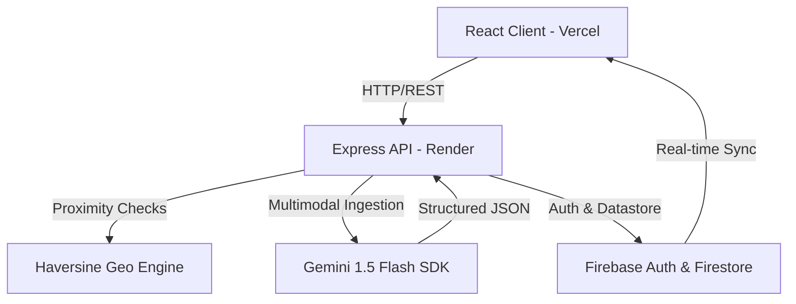

# Community Hero – Hyperlocal Problem Solver
### Google Developers x Coding Ninjas Vibe2Ship Hackathon Project Description

---

## 1. Project Details
- **Project Name**: Community Hero – Hyperlocal Problem Solver
- **GitHub Repository**: [https://github.com/Rushabh-Yadav/community-hero-hyperlocal-problem-solver](https://github.com/Rushabh-Yadav/community-hero-hyperlocal-problem-solver)
- **Live Demo Link**: *[Paste your Vercel URL here, e.g., https://community-hero-hyperlocal-problem-solver.vercel.app]*
- **Backend API URL**: [https://community-hero-hyperlocal-problem-solver.onrender.com](https://community-hero-hyperlocal-problem-solver.onrender.com)

---

## 2. Problem Statement
Local community members struggle with municipal issues (e.g., potholes, water leaks, illegal dumping, broken streetlights, drain blockages) because reporting channels are fragmented, slow, and lack transparency. There is no automated system to triage reports, detect nearby duplicates to avoid waste, verify user reports using community consensus, or route problems directly to the appropriate government department.

---

## 3. Problem Overview
- **Fragmented Reporting**: Citizens must use different portals or phone lines for different issues, leading to low engagement.
- **Officer Overload**: Government officers are inundated with unverified, unstructured, or duplicate complaints, making it difficult to prioritize critical infrastructure repairs.
- **Lack of Transparency**: Citizens have no visibility into the repair process once a report is filed.
- **Voter Apathy**: A lack of gamification or social validation results in low community involvement.

---

## 4. Solution Overview
**Community Hero** is a unified, AI-powered civic engagement platform that bridges the gap between citizens and local government officers. 

Using **Google Gemini 1.5 Flash**, the system automatically processes multilingual user complaints (supporting voice recordings, text descriptions, and photos/videos) to categorize the issue, estimate severity, outline repair checklists, and assign it to the correct department in real-time. 

A custom **Haversine Duplicate Detection** engine screens incoming reports against active nearby issues to prevent clutter. 

A gamified consensus loop rewards citizens with **XP points, levels, and badges** for submitting reports and verifying others' updates, creating a self-governing community hub.

---

## 5. Key Features
### A. Citizen Portal
- **Multimodal Submissions**: Upload text, images, videos, or record a **voice message** describing the issue.
- **Consensus Voting**: Upvote local issues to verify them. When an issue reaches **5 upvotes**, it automatically promotes to "Verified" status.
- **Dynamic Leaderboards & Gamification**: Gain XP for active civic participation and level up from "Civic Novice" to "Community Hero."
- **Interactive Hotspot Mapping**: Cluster-based map displaying real-time issue pins and density heatmaps.

### B. Officer & Admin Workstation
- **Priority Dispatch**: Officer dashboard displaying critical cases routed automatically to their specific department.
- **Interactive Checklists**: Gemini-generated step-by-step resolution checklists.
- **Verification Proof Review**: Verify citizen comment photos submitted as proof of repair.
- **Analytics & Impact Dashboard**: Recharts-based telemetry outlining resolved issues, department performance, and community trust metrics.
- **Predictive AI Modeling**: Visual representation of future infrastructure failure risks (e.g., asphalt decay, flooding).

### C. Context-Aware AI Chatbot
- **Interactive AI Assistant**: Citizen chat console capable of querying the database (via mock-indexing) to answer questions about local issues, guidelines, and reporting status.

---

## 6. Technologies Used
- **Frontend**: React, Vite, TypeScript, Tailwind CSS (v3), Framer Motion, Recharts, Canvas-Confetti
- **Backend**: Node.js, Express, TypeScript, Multer, Helmet, CORS, Morgan, Token-Bucket Rate Limiter
- **Hosting Platforms**: Vercel (Client), Render (Server)

---

## 7. Google Technologies Used
- **Gemini AI SDK (`@google/genai`)**: Translates voice/text transcripts and images into structured JSON schema outputs containing category, severity, priority, department, repair timelines, and resolution checklists.
- **Firebase Admin SDK & Firebase Client**: Provides authentication tokens, user profile syncing, and cloud storage triggers. Includes offline mock engines for quick, zero-config local testing.

---

## 8. AI Workflow
1. **Ingestion**: User submits a report with an image and voice note.
2. **Analysis**: Express backend passes the inputs to Gemini 1.5 Flash.
3. **Structured Extraction**: Gemini interprets the image (e.g., detecting pothole size) and outputs structured data:
   - *Category*: `pothole`
   - *Severity*: `critical`
   - *Department*: `Roads and Infrastructure`
   - *Checklist*: `["Secure site", "Fill cavity", "Resurface asphalt"]`
4. **Duplicate Prevention**: Backend calculates proximity to active issues using the Haversine formula (150m radius). If a duplicate is found, the report is flagged for review instead of creating a new issue.
5. **Dispatch**: Routed instantly to the assigned department's workstation.

---

## 9. System Architecture

---

## 10. Future Scope
- **IoT Integration**: Smart streetlights or drain sensors reporting failures directly to the API.
- **WhatsApp/Telegram Bot**: Direct integrations to allow citizens to report problems via chat messaging apps.
- **Dynamic Routing Optimization**: Recommending optimal daily route paths for municipal repair crews using Google Maps Directions API.
